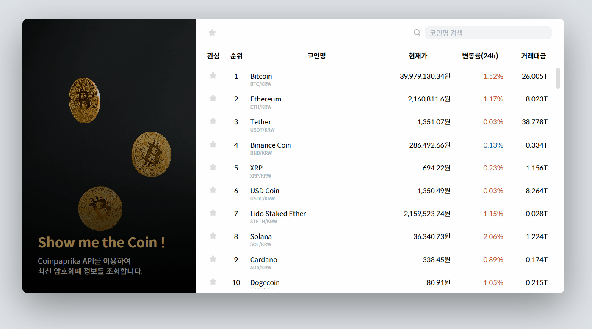

# Show me the Coin

- https://rigood.github.io/showmethecoin
- Coinpaprika API에서 제공하는 암호화폐 순위와 가격 정보를 확인할 수 있습니다.
- 코인명으로 검색이 가능하고, 관심코인을 등록하고 모아볼 수 있습니다.

<br>

|          코인명 검색           |
| :----------------------------: |
|  |

|     관심코인 등록 / 모아보기     |
| :------------------------------: |
|  |

<br>

## 프로젝트 특징

- 리액트를 처음 배울 당시 useState로 상태관리를 연습하기 위해 만든 프로젝트입니다.
  - 로딩 상태 관리
  - (검색/관심코인) 필터링 시 중복 상태 최소화

<br>

- useEffect를 통해 초기 실행 시에만 API 데이터를 받아옵니다.  
  데이터 캐싱 라이브러리를 사용하지 않았기 때문에, 실시간으로 정보가 업데이트 되지 않습니다.
  - cf) react-query를 사용한 coin-tracker 프로젝트 -> [Coin101](https://github.com/rigood/coin101)

<br>

## 폴더구조

```
📦 root
├─ 📦 public
│  ├─ 📂 icons
│  └─ 📜 index.html
└─ 📦 src
   ├─ 📂 assets
   │  ├─ 📂 fonts
   │  ├─ 📂 icons
   │  └─ 📂 images
   ├─ 📂 components
   │  ├─ 📜 Aside.jsx
   │  ├─ 📜 Coin.jsx
   │  ├─ 📜 CoinTable.jsx
   │  └─ 📜 Loading.jsx
   │  └─ 📜 SearchBar.jsx
   ├─ 📂 styles
   │  ├─ 📜 fonts.css
   │  ├─ 📜 GlobalStyle.jsx
   ├─ 📜 App.jsx
   └─ 📜 index.js
```

<br>

## 리팩토링 (2023.10.21)

- App.js에 뭉쳐있던 코드를 컴포넌트 단위로 분리
- 삼항연산자를 사용하여 코드 단축
- styled-components의 props를 활용한 스타일링
- 가상 요소 ::before를 활용하여 버튼 터치영역 확장
- 웹폰트 로딩 방식 변경(cdn 링크 -> 서버 폰트), 서브셋 폰트 사용
- 변수명 수정 및 사용하지 않는 초기 파일 삭제

<br>
